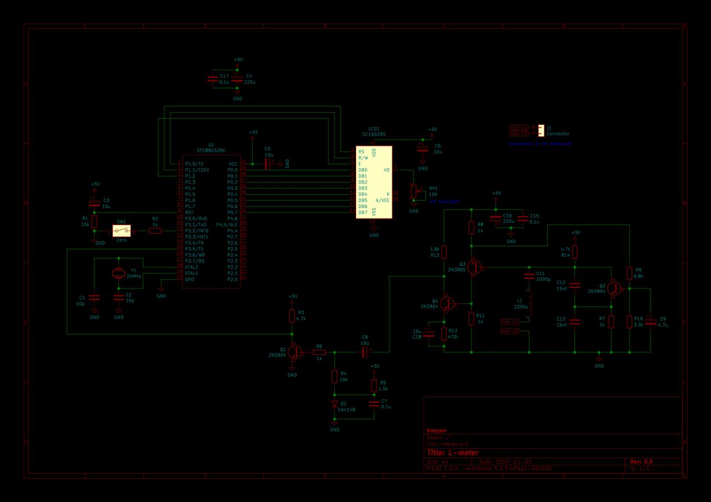
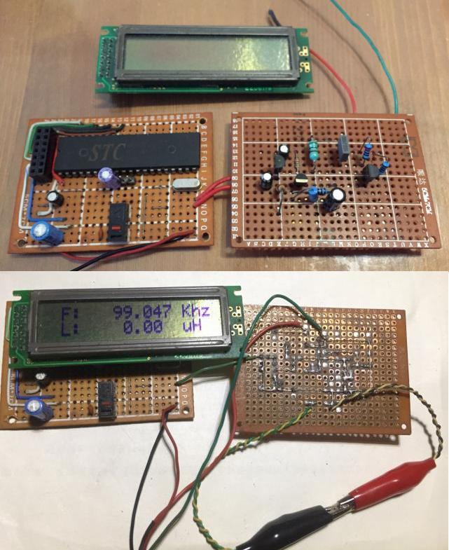
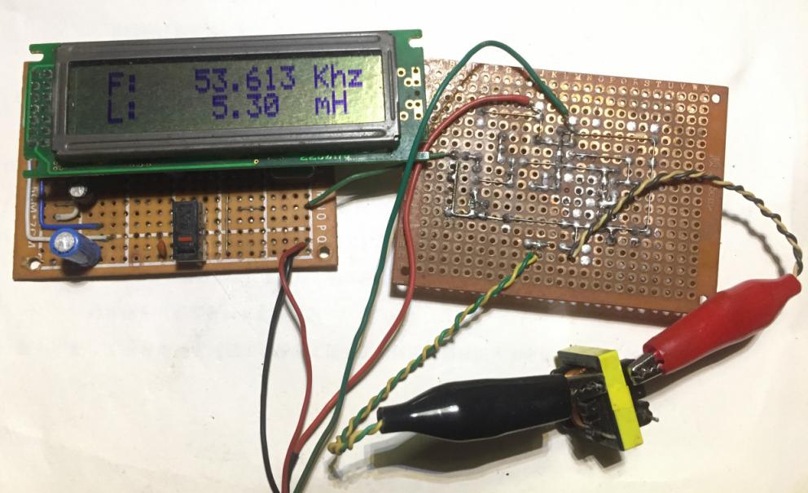

## STC89C52RC 电感表

* 玩超声波，需要估算电感绕制圈数和测量电感。借鉴 https://electronics-diy.com/ 和各路大神的作品。不过呢，即没 pic 单片机，也没有 lm311。这里将 pic 单片机换为 stc89c52rc , lm311 由克拉泼 LC 振荡电路替换。
* 实测的频率摆动约 +1khz。
* 由于电容没有测量需要，这里仅计算了电感量，没有支持电容测量切换。

#   

#### 电路图

>

# 

#### 实物

>

# 

#### 测量22瓦电子整流器电感

>

# 

#### 最后

>这里只有测量电感的需要，没有精度要求。用于不拆毁线圈估算磁芯电感的圈数，或者得到电感的近似值。不适宜测量Q值低的电感。

# 

 11/19/2022 重庆，封控中 

